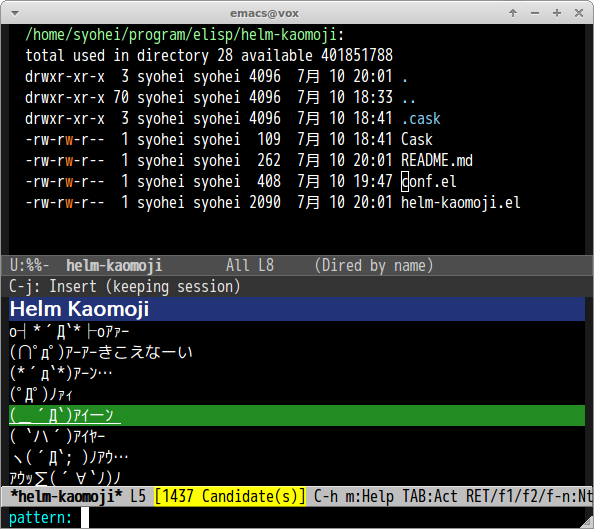

# helm-kaomoji.el

Kaomoji with helm interface. This package is inspired by [ctrlp-kaomoji](https://github.com/mattn/ctrlp-kaomoji).

## Screenshot

## Interface

#### `M-x helm-kaomoji`

Show Kaomoji with helm-interface
